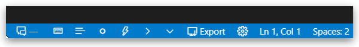

# Typewriter Mode

*documentation coming soon...*

# Writing Mode

Visual Studio Code, already has a great distraction free mode called [Zen Mode](https://code.visualstudio.com/docs/getstarted/tips-and-tricks#_zen-mode).

But, sometimes, you might prefer differnet font-size or a completely different theme when writing.

Also, you might want to toggle multiple settings all at once, like TypeWriterMode or FocusMode.

This is possible with Writing Mode.

There are two keybindings

- ++ctrl+f11++ that will switch both _Writing Mode_ and _Zen Mode_. It is just like pressing ++shift+f11++ followed by ++ctrl+k++ ++z++

and

- ++shift+f11++ that will switch only _Writing Mode_ `On` or `Off`

??? setting "Writing Mode: Font Size"
    - Key: `fictionWriter.writingMode.fontSize`
    - Default: `20`

Font size can be set either by opening Settings view, or by using the **Select Writing Mode Font Size** Command

??? setting "Writing Mode: Theme"
    - Key: `fictionWriter.writingMode.theme`
    - Default: `empty`

The writing theme can also be set from settings, but is much easier to select it using the **Select Writing Mode Theme** Command, as it will display a drowpdown with all installed themes to choose from.

??? setting "Writing Mode: Toggle Focus Mode"
    - Key: `fictionWriter.writingMode.toggleFocusMode`
    - Default: `enabled`

You also have the option to switch to Focus Mode when entering writing mode, by setting **Toggle Focus Mode**

# Fold Paragraph lines

??? setting "Setting"
    `fictionWriter.view.foldSentences`

Separate lines from same paragraph can be folded/unfolded. This is specailly useful when OneSentencePerLine writing technique is used.

Folding works for dialogue indents as well, if writing dialgoues with dialogue markers (like em-dash) is used:

# Syntax Highlighting

??? setting "Settings"
    `mfictionWriter.view.highlightDialogueMarkers`
    `fictionWriter.view.highlightDialogue`

# Word Wrap Indent

*documentation coming soon...*

# Status Bar

!!! setting "fictionWriter.view.statusBar.enabled"

This extension comes with a status bar, enabled by default.

