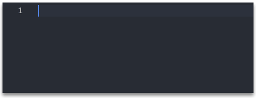
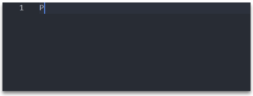
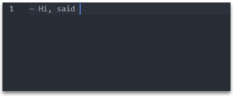
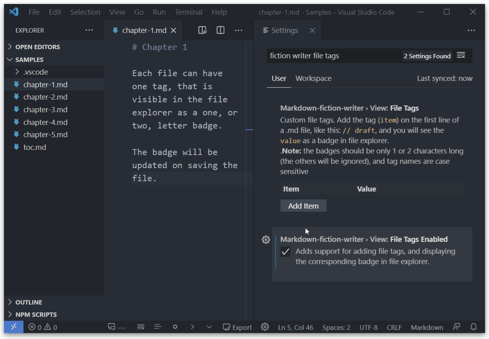
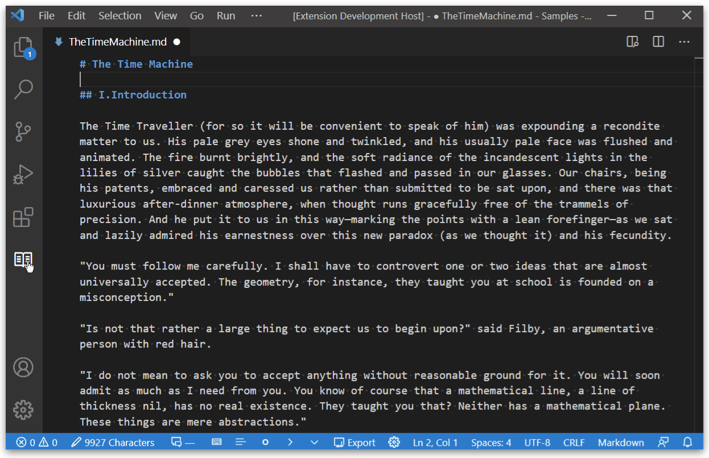
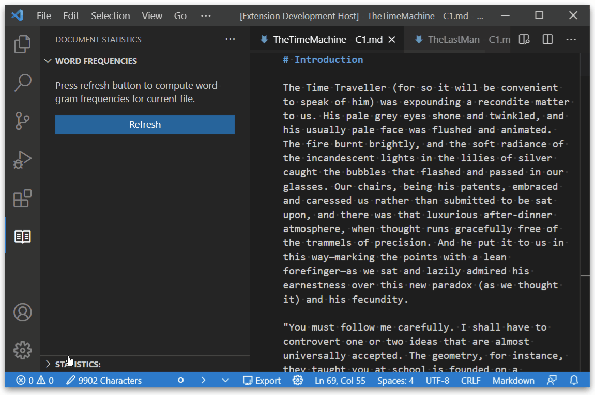

# Text Editing

## Disable Key-bindings

!!! setting "`markdown-fiction-writer.edit.disableKeybindings`"

Disables the following keybindings added by this extension:
- ++enter++, ++shift+enter++, ++delete++, ++backspace++, ++tab++)

**Note:** If `disabled`, some of the other features, that depend or ar triggered by this keybindings will be disabled (eg. easy Paragraph Creation needs ++enter++ end ++shift+enter++ in order to work properly).

 
## Easy Paragraph Creation

!!! setting "`markdown-fiction-writer.edit.easyParagraphCreation`"

To create paragraphs in markdown, you need to add an extra empty line. That, usually, means pressing ++enter++ key twice.

With this setting, you can easily create new paragraphs by hitting one key only (or a combination).

It has two options:

- **Enter**: pressing ++enter++ once will add two line-breaks, and pressing ++shift+enter++ will add one line-break.

    

- **Shift+Enter**: pressing ++enter++ once will add one line-break, but ++shift+enter++ will add two line-breaks.

    

## Writing Dialogues

This is a proposed solution for writing dialogue. In some languages, dialogue is not marked by quotation marks, but is marked only at the beginning a dialogue line.

For example, each line can start with em-dash (—), like so:

!!! quote "The Time Machine, by H. G. Wells"
  
    — You mean to say that that machine has travelled into the future? said Filby.

    — Into the future or the past. I don’t, for certain, know which.

    After an interval the Psychologist had an inspiration. 

    — It must have gone into the past if it has gone anywhere, he said.

Markdown can convert three dashes to em-dash and two dashes to en-dash. However, typing three dash character and one space is not necessarly convenient when writing lots of dialogue lines. 

A widespread practice is to write `-- ` for an `em-dash`, and the text editor will automatically replace it.

### Selecting dialogue punctuation:

??? setting "`markdown-fiction-writer.editDialogue.marker`"

    - `"Hello,"` (quotes) **default**
    - `— Hello,` (em-dash followed by one space)
    - `-- Hello`, (two dashes followed by one space)
    - `--- Hello,` (three dashes followed by one space)
    - `—Hello,` (em-dash, no space)
    - `--Hello,` (two dashes, no space)
    - `---Hello,` (three dashes, no space

With this feature, you can controlsthe punctuation used when writing dialogue.

The following options are possible:

- Quotes: _"Hello," John said._ (**default**: this is equivalent with disabling all proposed dialogue features)
- Em-dash followed by one space: _— Hello, John said._
- Two dashes followed by one space:  _`-- `Hello, John said._
- Three dashes followed by one space: _`--- `Hello, John said._
- Em-dash, no space: _—Hello, John said._
- Two dashes, no space: _`--`Hello, John said._
- Three dashes, no space: _`---`Hello, John said._


Once a dialogue marker is selected (other than quotes), the paragraph starting with that marker will be recognized as a dialogue paragraph enabeling other dialogue related features, like text formatting, auto replace, etc.

### Auto-replace dialogue markers

!!! setting "`markdown-fiction-writer.editDialogue.markerAutoReplace`"

If enabled, typing `--` followed by a space will insert the selected marker.


Disable this feature if you do not want to auto-replace markers.

### Easily create new dialogue paragraphs

Selecting a dialogue marker (other than quotes) changes the *Easy Paragraph Creation* behaviour as follows:

- if new paragraph is created (either by ++shift+enter++ or by ++enter++), and is from a dialogue paragraph (meaning, the paragraph starts with a marker), then the next paragraph will automatically start with the selected dialogue marker. 

This makes writing alternative dialogue lines much faster.



- when hitting new line, if the only thing on that line is a dialogue marker, is automatically deleted.

- when hitting backspace, and the only thing in front of the cursor is the dialogue marker, the line will be cleared

### Using Dialgoue indents:

Indent for sequential lines of the same dialogue paragraph. (`0` for no indenting)

This is especially useful when using the *one sentence per line* technique. Thus, having sentences from the same dialogue separated by simple line-breaks.

```
-- Hi, said the first dialogue line.
   I am here, on multiple lines.

-- Hi, said the other dialogue line.
   I am also here.

The two lines continued their chat.
```

!!! setting "`markdown-fiction-writer.editDialogue.sentenceIndent`"

The indent can be manually set under *Edit Dialouge - Sentence Indent*.

!!! setting "`markdown-fiction-writer.editDialogue.sentenceIndentAutoDetect`"

If *Edit Dialogue: Sentence Indent Auto-Detect* is enabled, the indent will be automatically calculated based on the selected dialogue marker, and the previous setting will be ignored.

Example:

```
-- Hi, this is a dialogue.
   It uses two dashes and one space.
   Thus, it has a 3 space indent.

— Hi, this uses em-dash and one space.
  It has just a two space indent.
```

# Formatting

## Enable Document Formatting

!!! setting "`markdown-fiction-writer.textFormatting.enabled`"

Enables all document formatting features.

!!! danger "Experimental"
    This is an experimental feature. It works by changing text in your document.
    Make sure you make a backup of your document before enabling this, or use
    is on drafts and test documents only.


## Remove extra spaces

!!! setting "`markdown-fiction-writer.textFormatting.removeExtraSpaces`"

Removes multiple spaces (not at beginning or ending of lines), with one space.

=== "Before"

    ``` md
    This is   a  text with  a lot  ,  of spaces.
    On multiple  lines  .

        Indents   are not removed    !
    ```

=== "After"

    ``` md
    This is a text with a lot, of spaces.
    On multiple lines.

        Indents are not removed!
    ```

## Remove Trailing Spaces

!!! setting "`markdown-fiction-writer.textFormatting.removeTrailingSpaces`"

Removes all whitespace characters from line ends.

=== "Before"

    ``` md
    This is a text.
    Having too much space at the end of each line.
    ```

=== "After"

    ``` md
    This is a text.
    Having too much space at the end of each line.
    ```


## Fix Paragraph Breaks

??? setting "`markdown-fiction-writer.textFormatting.fixParagraphBreaks`"
 
    - `none` **default**
    - `Soft line-breaks As New Paragraph`
    - `Soft line-breaks In Same Paragraph`
    - `One Sentence Per Line`

Converts soft and hard breaks, depending on the selected behaviour:

### Soft line-breaks As New Paragraph

- combines soft breaks from same paragraph into one line. (joins multi-line paragraphs)

    === "Before"

        ``` md
        This is a line
        with a soft linebreak.

        This is a new paragraph.
        With another line break.
        And another line break
        ```

    === "After"

        ``` md
        This is a line with a soft linebreak.

        This is a new paragraph. With another line break. And another line break
        ```

### Soft line-breaks In Same Paragraph

- Converts soft line-breaks to hard line-breaks. The result is having an extra empty before each soft break. (multiple paragraphs)

    === "Before"

        ``` md
        This is a line
        with a soft linebreak.

        This is a new paragraph.
        With another line break.
        And another line break
        ```

    === "After"

        ``` md
        This is a line

        with a soft linebreak.

        This is a new paragraph.

        With another line break.

        And another line break
        ```


### One Sentence Per Line

This is a technique used by some writers. It consists of writing each sentence from the same paragraph on a new line. Paragraphs are still marked with an empty line.

If enabled, this setting does the following:
- Splits each line in sentences (using the boundary characters: `.` `!` `?` `;` `:`)
- Adds every sentence on a new line.
- Keeps spacing between paragraphs.

=== "Before"

    ``` md
    # Using one sentence per line

    This means, each sentence. If in the same paragraph. Uses a soft line break.
    Already separated sentences, will remain as they are.

    Paragraph breaks are also kept. This is it.
    ```

=== "After"

    ``` md
    # Using one sentence per line

    This means, each sentence.
    If in the same paragraph.
    Uses a soft line break.
    Already separated sentences, will remain as they are.

    Paragraph breaks are also kept.
    This is it.
    ```

## Fix Paragraph Spacing

!!! setting "`markdown-fiction-writer.textFormatting.fixParagraphSpacing`"

Normalizes space between different paragraph types (header, body, dialogue, ...) by adding a new line if needed.

=== "Before"

    ``` md
    # This is a header
    And this is a first line. The second sentence is this.

    Then, a lot of empty lines here.
    ## This can be another header

    And a lot here.
    ***
    ```

=== "After"

    ``` md
    # This is a header

    And this is a first line. The second sentence is this.

    Then, a lot of empty lines here.

    ## This can be another header

    And a lot here.

    ***
    ```

## Remove Extra Lines

!!! setting "`markdown-fiction-writer.textFormatting.removeExtraLines`"

Reduces multiple empty lines (more than two), to a single empty line.

=== "Before"

    ``` md
    And this is a first line. The second sentence is this.


    Then, a lot of empty lines here.


    And a lot here.
    ***
    ```

=== "After"

    ``` md
    And this is a first line. The second sentence is this.

    Then, a lot of empty lines here.

    And a lot here.

    ***
    ```


## Fix Mismatch Dialogue Markers

!!! setting "`markdown-fiction-writer.textFormatting.fixMismatchDialogueMarkers`"

If the currently selected dialogue marker is not quotes, then it replaces all known dialogue markers (not quotes) with the selected one.

=== "Before"

    ``` md
    -- This text has mixed dialogue markers.

    --Some are without space.

    --- Yes, it has quite a lot.

    — It can be fixed.
    ```

=== "After"

    ``` md
    — This text has mixed dialogue markers.

    — Some are without space.

    — Yes, it has quite a lot.

    — It can be fixed.
    ```


## Fix Dialogue Indents

!!! setting "`markdown-fiction-writer.textFormatting.fixDialogueIndents`"

Replaces all dialogue indents (visible if one sentence per line technique is used) with the currently selected dialogue indent.

This works only if  `markdown-fiction-writer.editDialogue.marker`is not `quotes`, and `markdown-fiction-writer.editDialogue.sentenceIndent` is greater than 0, or `markdown-fiction-writer.editDialogue.sentenceIndentAutoDetect` is enabled

=== "Before"

    ``` md
    This text has mixed dialogue indents.

    -- Sentences for same dialogue.
        Start at different indents.

    -- Yes, this can be quite annoing sometimes.
    Some start too early.
                And some start too late.

    Of course, normal paragraphs are left untouched.
    ```

=== "After"

    ``` md
    This text has mixed dialogue indents.

    -- Sentences for same dialogue.
        Start at different indents.

    -- Yes, this can be quite annoing sometimes.
        Some start too early.
        And some start too late.

    Of course, normal paragraphs are left untouched.
    ```

# Exporting


## Requirements

!!! danger "Important!"
    This feature requires [Pandoc](https://pandoc.org). 
    
    
If you want to also compile `.md` to other document formats using this extension, you need to have [Pandoc](https://pandoc.org) installed on your machine, and configured to run from command line!

Pandoc is a universal document converter, that understands a large number of useful markdown syntax extensions, including document metadata (title, author, date); footnotes; tables; etc.

You can get it from here: [Installing pandoc](https://pandoc.org/installing.html).

You can test that pandoc is properly installed by opening your prefered command-line app and running:
```
pandoc --version
```

You should get an output similar to:
```
pandoc 2.11.4
Compiled with pandoc-types 1.22, texmath 0.12.1, skylighting 0.10.2,
citeproc 0.3.0.5, ipynb 0.1.0.1
User data directory: C:\Users\YourUserName\AppData\Roaming\pandoc
Copyright (C) 2006-2021 John MacFarlane. Web:  https://pandoc.org
This is free software; see the source for copying conditions. There is no
warranty, not even for merchantability or fitness for a particular purpose.
```


## Including other documents

This extension adds support for combining multiple markdown documents into one.

You can use the following syntax

```
{your_file.md}
``` 

from the markdown document you want to export, and this extension will include the contents of `your_file.md` in the exported document.

A common practice is to have just one TOC document, where you include all other documents.

A simple `toc.md` document can look like this:

```md
{chapter01.md}
{chapter02.md}
{chapter03.md}
{chapter04.md}
```
This will include all 4 referenced files.

Of course a TOC document can contain any additional markdown syntax:

```md

# My Book Title

## Preface

Some opening words

## Chapter One

{chapter01.md}

## Chapter Tso

{chapter02.md}

## The End

This is the end.
```

If `{chapter01.md}` does not exist, you will get a warning message, but the exporting will still continue with the other documents.

The path to included file needs to be relative to the document they are reference from.

For example, the `toc.md` from the following directory:
```
.
├─ toc.md
├─ prologue.md
├─ part1
│  ├─ ch1.md
│  ├─ ch2.md
│  └─ ch3.md
├─ part2/
│  ├─ ch4.md/
│  └─ ch5.md
└─ epilogue.md
```

could look like:

```md
{prologue.md}

{part1\ch1.md}
{part1\ch2.md}
{part1\ch3.md}

{part2\ch4.md}
{part2\ch5.md}

{epilogue.md}
```


## Commands

### Compile Current File

`[TBD]`

### Compile Selected files

Compiles all selected markdown documents (having `.md` extension) from current directory, into one file.

The include order is filename order.

`[TBD]`


### Compile TOC

Exports the TOC file.

A TOC file is a simple `.md` file that serves as a table of contents for exporting. The file-name can be configured under `markdown-fiction-writer.export.tocFilename`.

By default, the `toc.md` file-name will be used. 

If the TOC file is searched for in two locations:

- first, in the same folder as the opened document
- second, in the workspace root.

If no TOC files is found in either location, then compile will fail.

**Example:**
```
.
├─ toc.md          # The toc.md in workspace root
├─ part1
│  ├─ chapter1.md
│  ├─ chapter2.md
│  └─ toc.md        # The toc.md from part.1
├─ part2/
│  ├─ chapter3.md/
│  └─ chapter4.md
```

- if `chapter1.md` is opened, and **Compile toc.md** command is run, then `/part1/toc.md` will be used.

- if `chapter4.md` is opened, and **Compile toc.md** command is run, then `/toc.md` from workspace root will be used.

# View

## Typewriter Mode

`[TBD]`

## File Tags

??? setting "Settings"
    `markdown-fiction-writer.view.fileTags`
    `markdown-fiction-writer.view.fileTagsEnabled`
    
Ability to add tags to files. Each file will display the corresponding badge (1 or 2 letter word) in file explorer:



- Go to: `markdown-fiction-writer.view.fileTags`
- Add a few tags (eg. `draft` = `D`, and `rev1` = `R1`)
- Then open any `.md` file, and add `// draft` or `// rev1` on **the first line**.
  - if the tag line is not on the first line of the file, the tag will be ignored
- Save the document.
- You should see `D` or `R1` as a badge in file explorer, near your document.

!!! warning "Under development"
    Tagging works for files in the same folder as opened file. 
    Soon will work on all opened files in the workspace.

## Writing Mode

`[TBD]`

## Fold Paragraph lines

??? setting "Setting"
    `markdown-fiction-writer.view.foldSentences`

Separate lines from same paragraph can be folded/unfolded. This is specailly useful when OneSentencePerLine writing technique is used.


Folding works for dialogue indents as well, if writing dialgoues with dialogue markers (like em-dash) is used:

## Syntax Highlighting

??? setting "Settings"
    `mmarkdown-fiction-writer.view.highlightDialogueMarkers`
    `markdown-fiction-writer.view.highlightDialogue`


## Word Wrap Indent

[tbd]

# Text Analysis

## Compute word frequency

You can compute the repetition frequency of words and phrases up to 5 words.



## Get Writing Statistics

Compute statistics like:

- word count
- characters (excluding spaces)
- characters (including spaces)
- estimates:
  - word count (At 6 characters per word)
  - lines (At 10 words per line)
  - pages (At 24 lines per page)


Press the refresh button to compute statistics for the current open file.



## Writer Mode

`[TBD]`

## Status Bar

!!! setting "markdown-fiction-writer.view.statusBar.enabled"

This extension comes with a status bar, enabled by default.


