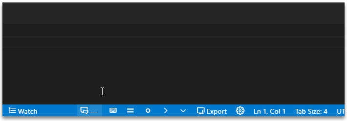
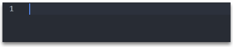

## Disable Key-bindings

??? setting "Setting"
    `markdown-fiction-writer.edit.disableKeybindings`

If `false`, custom editing actions will be enabled, on: ++enter++, ++shift+enter++, ++tab++, ++backspace++, ++delete++.

Read more [here](../shortcuts.md)

 If `true`, then no keybindings will be set. So all editing features will be disabled.

## New Paragraph Handling

??? setting "Setting"
    `markdown-fiction-writer.general.new-paragraph-handling`

It has two options:

### 1. newParagraphOnShiftEnter

- Create new paragraph with ++shift+enter++.

    

### 2. newParagraphOnEnter

- Create new paragraph (empty lines) without hitting ++enter++ twice.

- This comes especially handy when writing short paragraphs. ++enter++ adds two one empty line, and ++shift+enter++ adds simple line break.

    

## Writing Dialogues

### Using Dialgoue markers:

??? setting "Setting"
    `markdown-fiction-writer.edit.dialogueMarker` one of:

    - `"Hello,"` (quotes) **default**
    - `— Hello,` (em-dash followed by one space)
    - `-- Hello`, (two dashes followed by one space)
    - `--- Hello,` (three dashes followed by one space)
    - `—Hello,` (em-dash, no space)
    - `--Hello,` (two dashes, no space)
    - `---Hello,` (three dashes, no space

In some non-english languages, you need to write dialgoue lines using an em-dash (—) at the begining of each line.

Markdown, by default, converts three dashes to em-dash and two dashes to en-dash. However, that is not necessarly convenient when writing lots of dialogue lines.

Once a dialogue marker is selected (otehr than quotes), you can easily insert the dialogue marker by opting in for **auto-replacing** `-- ` to that marker.

??? setting "Setting"
    `markdown-fiction-writer.edit.dialogueMarkerAutoReplace`

Selecting a dialogue marker, changes the insert new paragraph behaviour as follows:

- if new paragraph is created (either by ++shift+enter++ or by ++enter++), and is from a dialogue paragraph (meaning, the paragraph starts with a marker), then the next paragraph will automatically start with the selected dialogue marker. Making writing quick dialogue lines much faster.

- when hitting new line, if the only thing on that line is a dialogue marker, is automatically deleted

- when hitting backspace, and the only thing in front of the cursor is the dialogue marker, it will delete it completely

### Using Dialgoue indents:

??? setting "Setting"
    `markdown-fiction-writer.edit.dialogueIndent`

??? setting "Setting"
    `markdown-fiction-writer.edit.dialogueIndentAutoDetect`