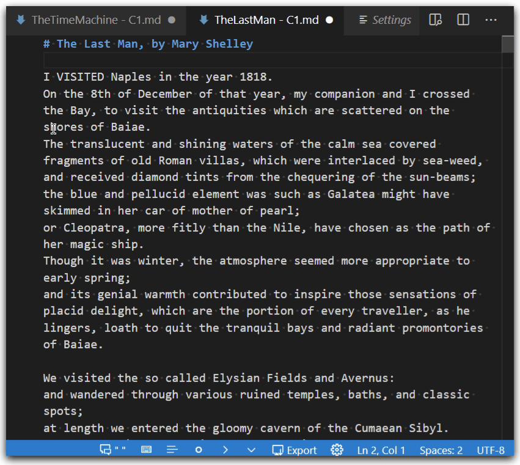

# Typewriter Mode

# Fold Paragraph lines

??? setting "Setting"
    `markdown-fiction-writer.view.foldSentences`

Separate lines from same paragraph can be folded/unfolded. This is specailly useful when OneSentencePerLine writing technique is used.

Folding works for dialogue indents as well, if writing dialgoues with dialogue markers (like em-dash) is used:

# Word Wrap Indent

[tbd]