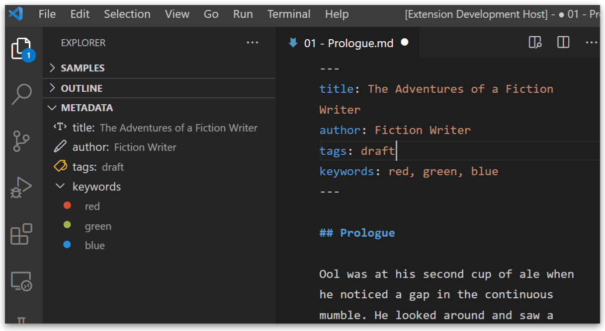

**Fiction Writer** understands `yaml` markdown metadata.

To use metadata blocks with **Fiction Writer**, you need to:

- add the metadata block on the top of the document (no even an empty line before the beginning of text)
- separate the block with `---` and end the block with `---` or `...`, each one on a separate line.
- follow `yaml` structure
- e.g.
  ```yaml
  ---
  title: The Fictional Adventures of Fiction Writer
  status: draft
  tags: [red, green, blue]
  ---
  
  It was a cold and starry night...
  ```

!!! note Pandoc and Metadata
    As this extension uses **Pandoc** to export documents, keep in mind that **Pandoc** also parses, and understands, markdown metadata.

    Read more about what kind of metadata is supported by **Pandoc** here: [Metadata blocks](https://pandoc.org/MANUAL.html#extension-yaml_metadata_block).


# Terminology

In the context of metadata, this extension uses the following wording:

- **metadata category**: the label/fieldname on the 1^st^ level of metadata.
- **metadata keyword**: any word in the label/field value of a metadata category, anyware in the metadata tree.
- in the following example, `title`, `status` and `tags` are metadata _categories_, and `draft`, `red`, `green`, `blue`, `Main Title` are _keywords_:
  ```yaml
  ---
  title: Main Title
  status: draft
  tags: [red, green, blue]
  ---
  ```

# `yaml` Exceptions

## Easy Lists

??? setting "markdown-fiction-writer.metadata.easyLists"
    Under **Metadata: Easy Lists**, you can configure if you want to split metadata values by a specific character.

    The default value is comma (`,`), that means each comma separated item will be treated as a list item.
    
    To `disable` this setting, just leave the **Metadata: Easy Lists** value blank.

Although lists (arrays) in yaml are defined like:

```yaml
---
items:
- item1
- item2
- item3
---
```

or like

```yaml
---
items: [item1, item2, item3]
---
```

to make writing lists easyer, **Fiction Writer** can split a text value into a list, by a configured item separator.

So, the, previous example could be written like so:

```yaml
---
items: item1, item2, item3
---
```

if the separator is `,`. The separator is configurable under **Metadata: Easy Lists**.

!!! danger "Spaces are not trimmed"
    If this feature does not behave as expected, make sure that the separator value does not include unwanted spaces. Especially at the beginning or end.


## Default categories

??? setting "markdown-fiction-writer.metadata.defaultCategory"
    Under **Metadata: Default Category**, you can configure the default category you want uncategorized items to be assigned to. To disable this feature, just leave the default category name empty.

If you quickly want to categorize a document, you can write only the _keyword_ or _keywords_ between the metadata block markers, like so:

```yaml
---
item1, item2, item3
---
```

or even

```yaml
---
draft
---
```

This will automatically add these items to the configured **Default Category**

e.g. If the **Default Category** is `status`, then the above blocks will be similar to:

```yaml
---
status: [item1, item2, item3]
---
```

```yaml
---
status: draft
---
```


# The Metadata View

For all known documents (in this case, markdown) that contain `yaml` metadata, the **Metadata View** will be enabled in the **Explorer**.

The view parses known metadata, and displays it as a tree. 

It optionally can include icons, or colors.


# Icons

!!! setting "`markdown-fiction-writer.metadata.categories`"
    *coming soon*

!!! setting "`markdown-fiction-writer.metadata.categoryIconsEnabled`"
    *coming soon*

# File Explorer Badges

!!! setting "`markdown-fiction-writer.metadata.keywords.badges`"
    *coming soon*

!!! setting "`markdown-fiction-writer.metadata.keywords.badgeCategory`"
    *coming soon*

!!! setting "`markdown-fiction-writer.metadata.keywords.badgesInFileExplorer`"
    *coming soon*

# Keywords and Colors

!!! setting "`markdown-fiction-writer.metadata.keywords.colors`"
    *coming soon*

!!! setting "`markdown-fiction-writer.metadata.keywords.colorCategory`"
    *coming soon*

!!! setting "`markdown-fiction-writer.metadata.keywords.colorsInMetadataView`"
    *coming soon*

!!! setting "`markdown-fiction-writer.metadata.keywords.colorsInFileExplorer`"
    *coming soon*