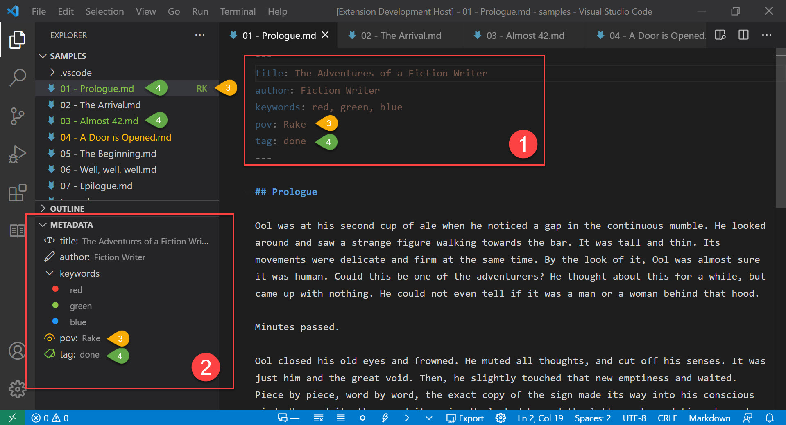
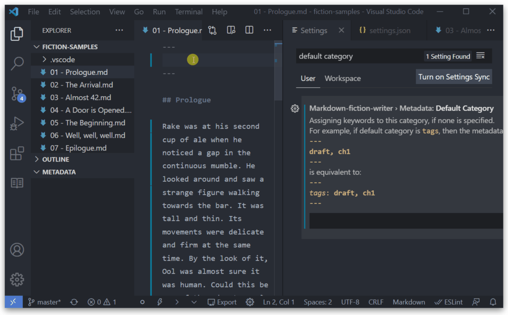
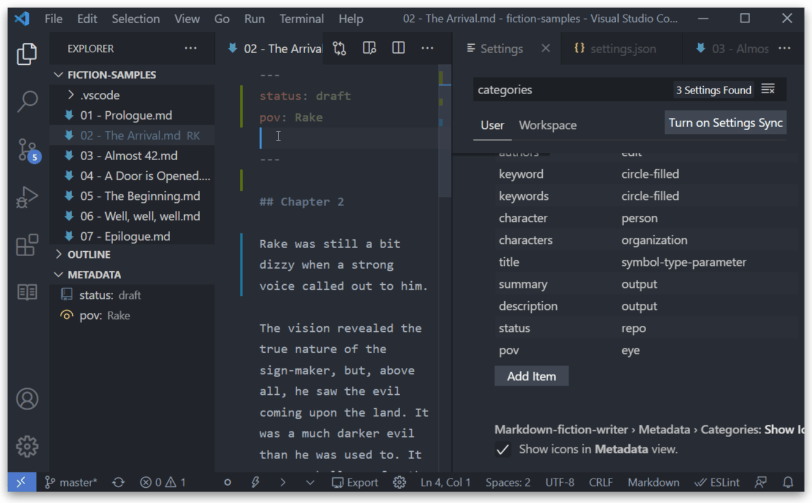

Quick overview:



- **(1)**: The `yaml` metadata block. The first thing in the document.

- **(2)**: The **Metadata** tree view. Parses the metadata block.

- **(3)**: Assign keyword badges: `Rake` has the badge `RK`, shown in **Explorer**. It also is part of `pov` category, visible in **Metadata** view

- **(4)**: Assigned keyword colors: `done` has the color green, visible as icon color in **Metadata** and as file color in **Explorer**. The `04 - A door is opened.md` has the tag `rev1` that has the yellow color.

??? setting "`config.markdown-fiction-writer.metadata.enabled`"
    - Enables/disables all metadata related features described in this section.
    - Default: `enabled`

# Adding Metadata

**Fiction Writer** understands `yaml` markdown metadata.

To use metadata blocks with **Fiction Writer**, you need to:

- add the metadata block on the top of the document (no even an empty line before the beginning of text)
- separate the block with `---` and end the block with `---` or `...`, each one on a separate line.
- follow `yaml` structure
- e.g.
  ```yaml
  ---
  title: The Fictional Adventures of Fiction Writer
  status: draft
  tags: [red, green, blue]
  ---
  
  It was a cold and starry night...
  ```

!!! note Pandoc and Metadata
    As this extension uses **Pandoc** to export documents, keep in mind that **Pandoc** also parses, and understands, markdown metadata.

    Read more about what kind of metadata is supported by **Pandoc** here: [Metadata blocks](https://pandoc.org/MANUAL.html#extension-yaml_metadata_block).


# Terminology

In the context of metadata, this extension uses the following wording:

- **metadata category**: the label/fieldname on the 1^st^ level of metadata.
- **metadata keyword**: any word in the label/field value of a metadata category, anyware in the metadata tree.
- in the following example, `title`, `status` and `tags` are metadata _categories_, and `draft`, `red`, `green`, `blue`, `Main Title` are _keywords_:
  ```yaml
  ---
  title: Main Title
  status: draft
  tags: [red, green, blue]
  ---
  ```

# Known Metadata

You can add any metadata category or keyword, but some categories are recognized (and used) by **Fiction Writer**:

- `id` category: used to uniquely identify a file during [include/export process](export.md#include-by-metadata-id). You can either specify a file by path/filename or by this metadata `id` property.

    ```yaml
    ---
    id: myFile
    ---

    My file contents...
    ```

    More information [here](export.md#include-by-metadata-id).

# The Metadata View

For all known documents (in this case, markdown) that contain `yaml` metadata, the **Metadata View** will be enabled in the **Explorer**.

The view parses known metadata, and displays it as a tree. 

It optionally can include icons, or colors.


# `yaml` Exceptions

## Easy Lists

??? setting "markdown-fiction-writer.metadata.easyLists"
    Under **Metadata: Easy Lists**, you can configure if you want to split metadata values by a specific character.

    The default value is comma (`,`), that means each comma separated item will be treated as a list item.
    
    To `disable` this setting, just leave the **Metadata: Easy Lists** value blank.

Although lists (arrays) in yaml are defined like:

```yaml
---
items:
- item1
- item2
- item3
---
```

or like

```yaml
---
items: [item1, item2, item3]
---
```

to make writing lists easyer, **Fiction Writer** can split a text value into a list, by a configured item separator.

So, the, previous example could be written like so:

```yaml
---
items: item1, item2, item3
---
```

if the separator is `,`. The separator is configurable under **Metadata: Easy Lists**.

!!! note
    This is only if the category is a _known category_, meaning: the category is added to the [Category icons](#icons) list, explained below.
  
!!! danger "Spaces are not trimmed"
    If this feature does not behave as expected, make sure that the separator value does not include unwanted spaces. Especially at the beginning or end.


## Default categories

??? setting "markdown-fiction-writer.metadata.defaultCategory"
    Under **Metadata: Default Category**, you can configure the default category you want uncategorized items to be assigned to. To disable this feature, just leave the default category name empty.

If you quickly want to categorize a document, you can write only the _keyword_ or _keywords_ between the metadata block markers, like so:

```yaml
---
item1, item2, item3
---
```

or even

```yaml
---
draft
---
```

This will automatically add these items to the configured **Default Category**

e.g. If the **Default Category** is `status`, then the above blocks will be similar to:

```yaml
---
status: [item1, item2, item3]
---
```

```yaml
---
status: draft
---
```




# Icons

!!! setting "`markdown-fiction-writer.metadata.categories.icons`"
    Predefined category icons, with the possiblity to add any number of new ones.

Sets icons for categories in the **Metadata View**.

Only icons from VSCode [Product Icon Reference](https://code.visualstudio.com/api/references/icons-in-labels#icon-listing) are supported.

Add your custom category name to the **Metadata > Categories: Icons** list (**Item**) and set it's value to the icon id from Product Icon Reference. (Eg. `tag`, `eye`, `book`).

There are some predefined icons and categories. If you want, you can easily change any predefined icon by editing it's value.



All categories from this list, are treated as _known categories_. This means, they will support the [Easy Lists](#easy-lists) functionality.

!!! note
    If you just want to add a category as _known category_, add it to this list, but leave the Icon (**Value**) field empty.

# Disable category icons or names

You can completely disable icons, by unchecking **Metadata > Category: Show Icons**

!!! setting "`markdown-fiction-writer.metadata.categories.showIcons`"
    Shows category icons in the **Metadata** view. Disable this if you do not want to view any icons.
    Default value: `enabled`


If you want, you can also hide category labels (only for 1^st^ level/root categories) by unchecking **Metadata > Category: Show Names**

!!! setting "`markdown-fiction-writer.metadata.categories.showNames`"
    Default value: `enabled`

# File Explorer Badges

!!! setting "`markdown-fiction-writer.metadata.keywords.badges`"
    *coming soon*

!!! setting "`markdown-fiction-writer.metadata.keywords.badgeCategory`"
    *coming soon*

!!! setting "`markdown-fiction-writer.metadata.keywords.badgesInFileExplorer`"
    *coming soon*

# Keywords and Colors

!!! setting "`markdown-fiction-writer.metadata.keywords.colors`"
    *coming soon*

!!! setting "`markdown-fiction-writer.metadata.keywords.colorCategory`"
    *coming soon*

!!! setting "`markdown-fiction-writer.metadata.keywords.colorsInMetadataView`"
    *coming soon*

!!! setting "`markdown-fiction-writer.metadata.keywords.colorsInFileExplorer`"
    *coming soon*